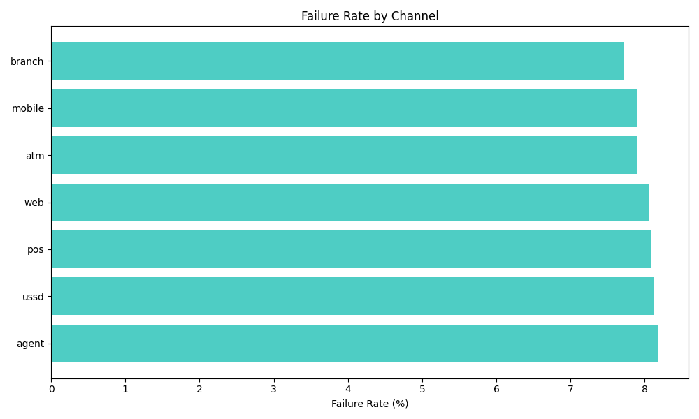
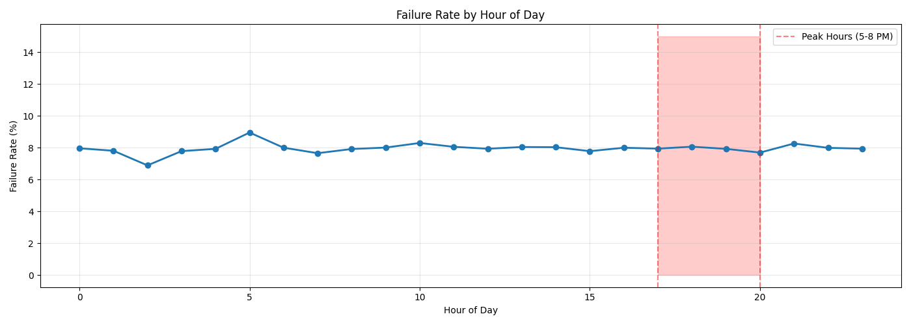
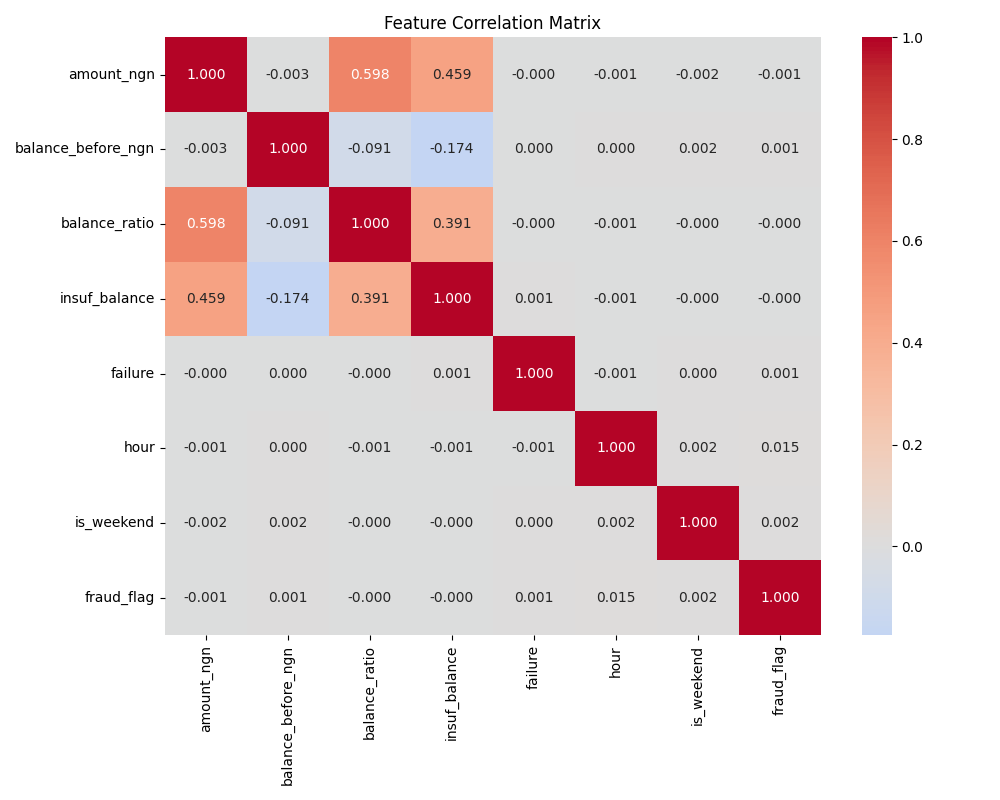

# Banking Risk Analytics Platform

## Project Overview
Machine learning system for Nigerian banking transactions predicting:
- **Transaction Failure** (technical failures)
- **Anomaly Detection** (unusual patterns)
- **Fraud Detection** (suspicious activity)

## Dataset
- Source: Nigerian banking retail transactions
- Size: 500,000 transactions
- Time period: 2023-2024

## Current Progress ✅

### Phase 1: Data Loading
- Loaded 500k transactions from parquet
- Verified data integrity (no null values)

### Phase 2: Exploratory Data Analysis
- **Failure Rate:** 7.97%
- **Fraud Rate:** 0.82% (4,088 cases)
- **Peak Hour:** 6 PM (69 transactions/hour)
- **System Load Range:** 1 to 97

### Phase 3: Feature Engineering
- Time features (hour, is_peak_hour, is_weekend)
- Financial features (balance_ratio, insuf_balance)
- System load feature
- Channel risk scores

## Key Visualizations

## Project Structure
# Banking Risk Analytics Platform

## Project Overview
Machine learning system for Nigerian banking transactions predicting:
- **Transaction Failure** (technical failures)
- **Anomaly Detection** (unusual patterns)
- **Fraud Detection** (suspicious activity)

## Dataset
- Source: Nigerian banking retail transactions
- Size: 500,000 transactions
- Time period: 2023-2024

## Current Progress ✅

### Phase 1: Data Loading
- Loaded 500k transactions from parquet
- Verified data integrity (no null values)

### Phase 2: Exploratory Data Analysis
- **Failure Rate:** 7.97%
- **Fraud Rate:** 0.82% (4,088 cases)
- **Peak Hour:** 6 PM (69 transactions/hour)
- **System Load Range:** 1 to 97

### Phase 3: Feature Engineering
- Time features (hour, is_peak_hour, is_weekend)
- Financial features (balance_ratio, insuf_balance)
- System load feature
- Channel risk scores

## Key Visualizations

## Project Structure
# Banking Risk Analytics Platform

## Project Overview
Machine learning system for Nigerian banking transactions predicting:
- **Transaction Failure** (technical failures)
- **Anomaly Detection** (unusual patterns)
- **Fraud Detection** (suspicious activity)

## Dataset
- Source: Nigerian banking retail transactions
- Size: 500,000 transactions
- Time period: 2023-2024

## Current Progress ✅

### Phase 1: Data Loading
- Loaded 500k transactions from parquet
- Verified data integrity (no null values)

### Phase 2: Exploratory Data Analysis
- **Failure Rate:** 7.97%
- **Fraud Rate:** 0.82% (4,088 cases)
- **Peak Hour:** 6 PM (69 transactions/hour)
- **System Load Range:** 1 to 97

### Phase 3: Feature Engineering
- Time features (hour, is_peak_hour, is_weekend)
- Financial features (balance_ratio, insuf_balance)
- System load feature
- Channel risk scores

## Key Visualizations

## Project Structure
banking-risk-analytics/
├── bank_project.ipynb # Main notebook
├── reports/ # EDA plots
├── models/ # Saved encoders
└── data_info.txt # Dataset summary

## Technologies
- Python, pandas, numpy
- matplotlib, seaborn
- scikit-learn, XGBoost

## Author
Gaurang Jain

## License
MIT
